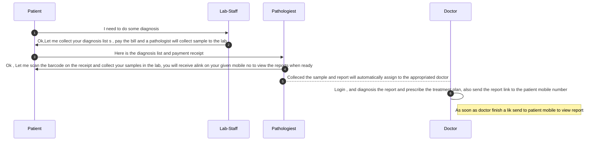

# Lab Report sample application

## Sequence Diagram

```mermaid
sequenceDiagram
 autonumber
  participant Patient
  participant Lab-Staff
  participant Pathologiest
  participant Doctor
  Patient->>Lab-Staff: I need to do some diagnosis

  Lab-Staff->>Patient: Ok,Let me collect your diagnosis list s , pay the bill and a pathologist will collect sample to the lab

 Patient->>Pathologiest: Here is the diagnosis list and payment receipt 
activate Pathologiest
 Pathologiest->>Patient: Ok ,  Let me scan the barcode on the receipt and collect your samples in the lab, you will receive alink on your given mobile no to view the reports when ready 

 Pathologiest-->Doctor:Colleced the sample and report will automatically assign to the appropriated doctor

 Doctor->Doctor: Login , and diagnosis the report and prescribe the treatment plan, also send the report link to the patient mobile number

Note right of Doctor: As soon as doctor finish a lik send to patient mobile to view report


```

