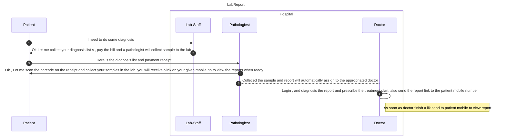

# Lab Report sample application

## Sequence Diagram


## How to install
   
```bash
mkdir my_project
cd my_project
git init
git pull https://github.com/mfrony2003/LabReport.git
```
Create virtual Environment and install the requried packages
```bash
py -m venv venv
venv\Scripts\activate.bat
pip install -r requirements.txt
```
RUN
```bash
python manage.py migrate
python manage.py createsuperuser
execute the inserctStatement.sql -- it will populate the data pre loaded data


| User                   | Password | Role |
| :--------------------  | :------: | ----: |
| staff@test.com         | 123456   | staff     |
| doctor1@test.com       | 123456   | doctor    |
| doctor2@test.com       | 123456   | doctor    |
| doctor3@test.com       | 123456   | doctor    |
| pathologist1@test.com  | 123456   | pathologist 
| pathologist2@test.com  | 123456   | pathologist 


$ python manage.py runserver

```
http://localhost:8000

# Step 1

Login as a staff user (staff@test.com). 


Add patient and add new diafonosis. View existing reports.

[

](url)

# Step 2

Login as pathologist user (pathologist1@test.com). and Collect Specimen 

[

](url)

# Step 3
Login as a doctor user (doctor1@test.com).you will get the info for whom its assign to . Diagnose the report and prescribe treatment plan.

[

](url)

Save

[

](url)


## DB Info
 url : http://localhost:8000/admin
 user :faisal
 pwd:test@123
 
 ## Change the Static text copy the below url to the browser
   http://localhost:8000/rosetta


   

   

